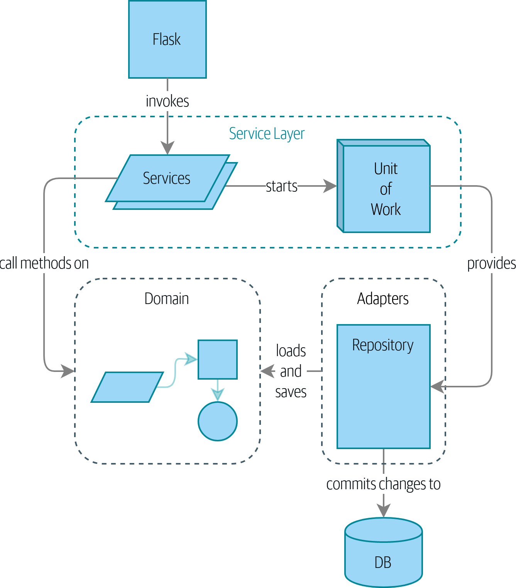

# Architecture Patterns with Python Notes

These are random notes made during the implementation of the example.
 
## Part 1: Building an Architecture to Support Domain Modeling

A component diagram for our app at the end of Building an Architecture to Support Domain Modeling:

### 1: Domain Modeling

At a high level, we have separate systems that are responsible for buying stock, selling stock to customers, and shipping goods to customers. A system in the middle needs to coordinate the process by allocating stock to a customer’s orders; see Context diagram for the allocation service.

Here’s the innovation the application brings: if we have a system that can keep track of all our shipments and when they’re due to arrive, we can treat the goods on those ships as real stock and part of our inventory, just with slightly longer lead times. Fewer goods will appear to be out of stock, we’ll sell more, and the business can save money by keeping lower inventory in the domestic warehouse.

#### Some Notes on Allocation
A *product* is identified by a *SKU*, pronounced "skew," which is short for stock-keeping unit. *Customers* place *orders*. An order is identified by an *order reference* and comprises multiple *order lines*, where each line has a *SKU* and a *quantity*. For example:

- 10 units of RED-CHAIR
- 1 unit of TASTELESS-LAMP

The purchasing department orders small batches of stock. A batch of stock has a unique ID called a reference, a SKU, and a quantity.

We need to allocate order lines to batches. When we’ve allocated an order line to a batch, we will send stock from that specific batch to the customer’s delivery address. When we allocate x units of stock to a batch, the available quantity is reduced by x. For example:

- We have a batch of 20 SMALL-TABLE, and we allocate an order line for 2 SMALL-TABLE.
- The batch should have 18 SMALL-TABLE remaining.

We can’t allocate to a batch if the available quantity is less than the quantity of the order line. For example:

- We have a batch of 1 BLUE-CUSHION, and an order line for 2 BLUE-CUSHION.
- We should not be able to allocate the line to the batch.

We can’t allocate the same line twice. For example:

- We have a batch of 10 BLUE-VASE, and we allocate an order line for 2 BLUE-VASE.
- If we allocate the order line again to the same batch, the batch should still have an available quantity of 8.

Batches have an ETA if they are currently shipping, or they may be in warehouse stock. We allocate to warehouse stock in preference to shipment batches. We allocate to shipment batches in order of which has the earliest ETA.

### 2: Repository Pattern

### 3: A Brief Interlude: On Coupling and Abstractions

### 4: Our First Use Case: Flask API and Service Layer

### 5: TDD in High Gear and Low Gear

### 6: Unit of Work Pattern

### 7: Aggregates and Consistency Boundaries

## Part 2: Event-Driven Architecture

### 8: Events and the Message Bus

### 9: Going to Town on the Message Bus

### 10: Commands and Command Handler

### 11: Event-Driven Architecture: Using Events to Integrate Microservices

### 12: Command-Query Responsibility Segregation (CQRS)

### 13: Dependency Injection (and Bootstrapping)

